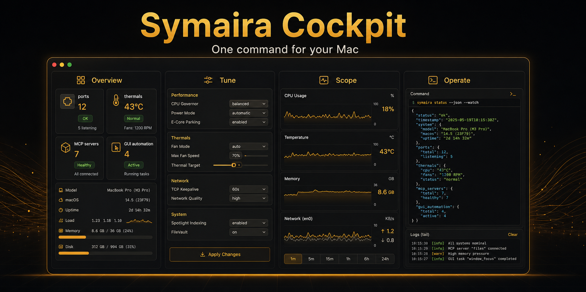

# Symaira Cockpit

**One command for your Mac: see what's running — and control what it does.**

`symcockpit` is a native macOS CLI that tunes your Mac's thermals, power and
display, inventories local ports, containers and the MCP servers registered by
symbrain, and automates the graphical interface. Everything speaks JSON — and
everything doubles as an MCP server, so AI agents get the exact same
capabilities you have in the shell.

[](https://github.com/danieljustus/symaira-cockpit/actions/workflows/ci.yml)
[](https://github.com/danieljustus/symaira-cockpit/releases)
[](https://github.com/danieljustus/symaira-cockpit/actions/workflows/ci.yml)
[](LICENSE)
[](#requirements)
[](https://swift.org)



**Status:** Active development — v0.5.5 released; see the [release history](https://github.com/danieljustus/symaira-cockpit/releases).

## Why Cockpit

The facts you constantly need while developing on a Mac are scattered across a
dozen places: Activity Monitor, `lsof`, Docker Desktop, System Settings,
`pmset`, and the harness registrations managed by symbrain. Symaira Cockpit
pulls the local machine facts into **one binary** with **one output format**:

- **Structured, not scrapeable.** Every command answers in JSON with stable
  field names. No parsing human-readable output, no `awk`.
- **Local, not cloud.** No telemetry, no account, no network access beyond the
  optional update check. What your Mac knows stays on your Mac.
- **Built for agents.** Every area runs as an MCP server over stdio on demand —
  the capabilities you have on the shell become tools for your AI assistant.
- **Native and fast.** Swift 6, straight against IOKit, Accessibility and
  ScreenCaptureKit. One universal binary, no runtime, no dependencies.

## Install

```bash
brew install danieljustus/tap/symcockpit
```

Or grab the universal binary (`arm64` + `x86_64`) from
[Releases](https://github.com/danieljustus/symaira-cockpit/releases) and drop it
into `/usr/local/bin`.

> The CLI binary is neither signed nor notarized. Installed via Homebrew,
> Gatekeeper's quarantine does not apply; after a manual download you need to
> clear it once (`xattr -d com.apple.quarantine ./symcockpit`).

## Quick start

```console
$ symcockpit scope ports list
[
  { "port": 3722, "pid": 631, "process": "node", "protocol": "tcp", "address": "*" },
  ...
]

$ symcockpit scope ports suggest 3
[ 49153, 49154, 49155 ]

$ symcockpit tune sensors
{ "thermal_pressure": "nominal", "fans": [ { "rpm": 1980 } ], "smc_supported": true }

$ symcockpit operate doctor
{ "ok": true, "capabilities": { "screenshot": true, "ocr": true, "accessibility": true } }
```

## The GUI

The same three areas, in a window — for the moments a glance beats a command.

```bash
brew install --cask danieljustus/tap/symcockpit
```

installs the signed and notarized menu bar app from the releases page — or grab
the `Symaira-Cockpit-*.dmg` directly from
[Releases](https://github.com/danieljustus/symaira-cockpit/releases).

```bash
make build-app                       # builds build/app/Symaira Cockpit.app
make run-app                         # …and launches it
```

Symaira Cockpit lives in the menu bar. The status item is Tune's: the live
readout you configure in Preferences, with the full control panel one click
away. Right-click it for the cockpit window, which adds

- **Overview** — ports, conflicts, containers, MCP servers and automation
  readiness as one row of numbers each,
- **Tune** — the same control panel the menu bar shows, off the same model,
  plus per-metric switches for what the status item displays,
- **Scope** — listening ports with conflicts flagged, running containers, and
  every configured MCP server, with an on-demand health probe,
- **Operate** — the Accessibility and Screen Recording grants automation needs,
  plus the apps, windows and displays currently on screen.

The Tune section's **Menu bar** card is the quick way to change the status
item: one switch per metric for *Monitor* (sample it) and one for *Menu bar*
(show it), with a live preview of the result. Changes hit the menu bar
immediately and are written to `config.toml`, so they survive a relaunch.

`⌘1`–`⌘4` switch sections, `⌘R` refreshes the one you are looking at, `⌘,`
opens preferences. Scope and Operate filter their lists from a single search
box, cards fold away and remember it, and long lists scroll inside their card
so one busy category never buries the rest.

Nothing in the window has its own logic: every number comes from the same core
services the CLI calls, so the window and the shell cannot disagree. The GUI
reads and configures — clicking and typing stay in `symcockpit operate` and the
MCP server, where the action policy applies.

> macOS keys permissions and Keychain access to the binary, so the app asks for
> its own grants the first time you use those features — separately from the
> CLI, even on the same Mac.

## The three areas

`symcockpit <area> <command>` — three problem domains behind one entrypoint.

### `scope` — what is running on this machine

An inventory of your local development environment: which process is holding
port 3000, which containers are up, and which MCP servers symbrain registered
for each AI harness. Ports, daemons and containers are fully standalone; only
MCP inventory is delegated to symbrain.

```bash
symcockpit scope scan                  # Full snapshot: ports, MCP, containers
symcockpit scope ports list            # Listening ports mapped to processes
symcockpit scope ports suggest 3       # Suggest free TCP ports
symcockpit scope conflicts             # Ports claimed by more than one process
symcockpit scope mcp list              # MCP servers from symbrain's harness view
symcockpit scope mcp health            # Health states reported by symbrain
symcockpit scope containers            # Running Docker containers
symcockpit scope explain port 5432     # What owns this port — and why
symcockpit scope watch --interval 5    # Changes as an NDJSON event stream
```

### `tune` — thermals, power, display

Read sensors and actively change system state: brightness well past the usual
ceiling, a dimming overlay and color temperature, fan speed, charge limit, sleep
prevention — plus battery health, top processes and system metrics.

```bash
symcockpit tune status                 # Health score, sensors, battery, overrides
symcockpit tune sensors                # Thermal pressure, temperatures, fan RPM
symcockpit tune battery                # Charge, cycles, capacity, condition
symcockpit tune processes --sort cpu   # The hungriest processes
symcockpit tune brightness set 0.8     # Built-in display brightness
symcockpit tune extbright set 1.4      # EDR / extended brightness beyond 100%
symcockpit tune warmth set 0.3         # Shift color temperature warmer
symcockpit tune awake --for 2h         # Stay awake for two hours
symcockpit tune profile save night     # Store the current settings as a profile
symcockpit tune fan profile comfort    # Three-position fan control
sudo symcockpit tune fan governor      # Run the temperature-tracking loop
sudo symcockpit tune fan set 0.5       # One-shot fan speed (SMC write)
sudo symcockpit tune battery-limit set 80
```

The SMC writes (fans, charge limit) require `root`. Values are clamped to safe
ranges and restored automatically on normal exit or `Ctrl-C`.

#### Fan control

The fan control has three positions. `system` is the default and writes
nothing at all — your Mac runs its own firmware curve exactly as it would
without this tool. `comfort` and `performance` start the fans earlier and ramp
them harder, so the chassis stays cool enough to keep on your lap and the chip
keeps its clocks under sustained load.

Neither of those is a fixed speed. Both keep following the CPU/GPU die
temperature, so an idle Mac is still quiet on `performance` and full speed is
reached only when the die is genuinely hot. Because the SMC holds whatever
target it was last given, the two governed positions are a loop
(`tune fan governor`) rather than a single write — in the cockpit app that
loop is started for you behind one administrator prompt, and moving between
positions afterwards needs no further prompt.

### `operate` — drive the interface

Full macOS GUI automation: screenshots, Accessibility tree queries, finding
elements via OCR, clicking, typing, scrolling, managing windows and apps. Built
for agents and end-to-end tests — with an action policy that defines what is
allowed.

```bash
symcockpit operate doctor              # Check permissions and environment
symcockpit operate permissions status
symcockpit operate permissions grant accessibility
symcockpit operate serve               # Expose it as an MCP server
symcockpit operate history --json      # Log of every action performed
```

`operate` is deliberately agent-shaped, and its full surface is exposed over
MCP: `snapshot`, `query_ui`, `find_ui`, `query_ui_ocr`, `click`, `type_text`,
`press_keys`, `scroll`, `drag`, `launch_app`, `focus_window`, `menu_action`,
`wait_for`, `list_apps`, `list_windows`, `list_displays`, `get_policy` /
`set_policy`.

## MCP / Agent integration

Every area speaks the Model Context Protocol over stdio. Add it to your AI
client's configuration:

```json
{
  "mcpServers": {
    "cockpit-scope": { "command": "symcockpit", "args": ["scope", "serve"] },
    "cockpit-tune": { "command": "symcockpit", "args": ["tune", "serve"] },
    "cockpit-operate": { "command": "symcockpit", "args": ["operate", "serve"] }
  }
}
```

Now an assistant can look up which process is blocking the port it needs, keep
the Mac awake through a long build, or drive an app through its interface —
without you playing middleman.

In every `serve` mode `stdout` carries JSON-RPC and nothing else; logs and
diagnostics go to `stderr`. No broken frames, not even on failure.

## Permissions and safety

Cockpit asks only for what the area you use actually needs, and `doctor` tells
you exactly what is missing:

| Capability | Requires |
| :--- | :--- |
| Ports, containers, MCP inventory | nothing |
| Sensors, battery, metrics, brightness | nothing |
| Fans, charge limit | `sudo` (SMC write) |
| Screenshots, OCR | Screen Recording |
| Clicking, typing, UI queries | Accessibility |

Every write action is recorded in a local history you can read back at any time
(`history`).

## Output contract

- **JSON everywhere.** Snake-case fields, stable keys, `--json` wherever a
  human-readable variant exists. Streams (`watch`) emit NDJSON.
- **Exit codes:** `0` success · `1` error · `2` usage/config · `3` missing
  permission · `4` unsupported on this system.
- **XDG paths:** config under `~/.config/`, cache under `~/.cache/`, data under
  `~/.local/share/`.

```bash
symcockpit version --json
```

## Requirements

- macOS 15 or newer, Apple Silicon or Intel
- Container inventory: a running Docker engine (optional)
- Fan and charge-limit control: access to the Apple SMC — not every model and
  not every macOS build permits it, and `tune sensors` will tell you

Unsupported capabilities report exit code `4` cleanly instead of guessing.

## Build from source

```bash
git clone https://github.com/danieljustus/symaira-cockpit.git
cd symaira-cockpit
make build      # Debug build of every component
make test       # Test suite
make build-app  # The GUI bundle (build/app/Symaira Cockpit.app)
swift build -c release --arch arm64 --arch x86_64
```

The repository is an SPM workspace: `Sources/symcockpit/` is the dispatcher,
`Sources/SymCockpitApp/` the GUI,
and [`tune/`](tune/), [`operate/`](operate/) and [`scope/`](scope/) are
standalone packages with their own test suites. Contributor details live in
[AGENTS.md](AGENTS.md).

> The app targets and the tests need the Xcode toolchain:
> `DEVELOPER_DIR=/Applications/Xcode-beta.app/Contents/Developer swift build`

## Contributing

Issues and pull requests are welcome. For anything larger than a fix, please
open an issue first so we can agree on the direction. Every contribution should
pass `make build` and `make test`.

## License

[Apache License 2.0](LICENSE) — © Daniel Justus
