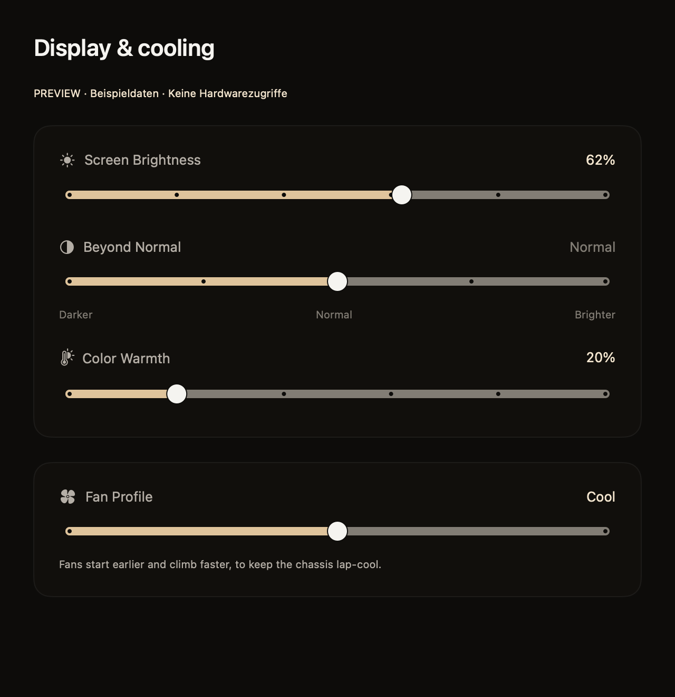

# Continuation after Symaira Cockpit v0.8.0

## Current checkpoint and scope

This section is the current continuation contract. The October 2 record below is
preserved as historical evidence; its older issue and publication states are
superseded by this section. No private chat, local agent skills or original Mac
filesystem is needed to read or implement the next code task.

- Repository: `https://github.com/danieljustus/symaira-cockpit.git` (public).
- Continuation branch: `handoff/cockpit-v0.8.0-cloud`.
- Base code commit: `57f08eefa575a82630276b771c12fa9d0b1f62d4`.
- Stable tag `v0.8.0` remains on `1cfac18e5612b620d3fe15cb1965072bdba620e1`.
- Working directory: repository root. Resolve every input below relative to it.

The work was the dark/gold native tuning-workspace and slider redesign (#312),
the public-documentation and passive-fixture fixes (#313/#314 via #317), release
preparation (#318), and protected-PR Homebrew publication repair (#319/#320).
All product changes are merged. The universal CLI, GUI ZIP, DMG and checksum
manifest are published at
[v0.8.0](https://github.com/danieljustus/symaira-cockpit/releases/tag/v0.8.0).
Downloaded bytes, compiled Cockpit 0.8.0 / embedded Tune 0.10.0, GUI Developer ID
signature, Gatekeeper and stapled notarization tickets were verified. #278,
#313, #314 and #319 are closed, not awaiting another release.

The original release workflow's Homebrew attempts failed. Recovery completed
through [tap PR #39](https://github.com/danieljustus/homebrew-tap/pull/39);
the corrected publisher was merged through #320. Do not claim the original
workflow run became green. Do not retag or replace stable published assets.

## Decisions and operating boundaries

1. Keep the Symaira dark/gold identity and hardware-tuning purpose. No chat,
   unrelated modules, Pro edition or cloud/billing features in Cockpit.
2. Keep one shipped CLI, `symcockpit`. Operate/Scope belong to Brain. Keep the
   existing `com.symaira.symtune` and helper identities and `SYMTUNE_*` prefix.
3. Reuse the shared native `EffortSlider`, `TuneSliderRow`,
   `CenterAnchoredSliderRow` and `FanProfileSliderRow`. Preserve continuous
   display ranges, pointer-only Normal snapping, keyboard movement away from
   Normal and the three existing safe thermal profiles. Do not weaken
   authorization, calibrated limits, rollback, root-owned executable resolution
   or MCP stdout/privacy boundaries.
4. `tune/Sources/SymTuneUI/CockpitDesignPreview.swift` contains labelled Debug
   fixtures and three native `#Preview` variants. It must not construct live
   controllers, read credentials, poll hardware or write preferences. Invalid
   fixture data fails explicitly, never through silent fallback readings.
5. Native keyboard and VoiceOver acceptance is still owner-deferred in #305.
   AX inspection, build success, fixture screenshots and cloud tests do not
   satisfy it. Do not raise windows or inject foreground input during active
   desktop use. No paid model/provider, release, permission change or physical
   hardware operation is authorized by this handoff.

## Inputs, preservation and exclusions

| Unit | Decision and cloud location |
|---|---|
| Product code, fixtures, release docs and publisher | Published on `main` at the base code SHA; original heads retained in public PR refs #312, #317, #318 and #320. No remaining uncommitted product WIP. |
| Local `release/v0.8.0` source tip | Exact `ec9d7503bdeece0e258fa2908726a12ca7f2e77b` is reachable as `refs/pull/318/head`; its merged release is the stable tag. Not an extra required branch. |
| Pre-slider rollback archive | All five original regular files preserved byte-for-byte under `v0.8.0/before-native-sliders/`, with source paths and SHA256 in `v0.8.0/before-native-sliders.json`. Historical source only, outside build targets; not a tested rollback candidate. Original local archive retained. |
| Approved slider fixture image | Exact reviewed pixels in `v0.8.0/sliders.png`, visibly labelled example data/no hardware access. No personal, credential or desktop content. |
| Coverage measurement and results | Existing stdlib-only `v0.8.0/measure.py`; path-sanitized actual line/hit records in `release-coverage.json` and `baseline-v0.7.0-coverage.json`; union totals in `coverage-summary.json`. No synthesized measurements. |
| Release verification and local gate reports | `v0.8.0/release-verification.json`, `release-coverage-report.md` and `prerelease-gate.md`. Historical prepublication instructions are explicitly marked obsolete. |
| Session-generated raw test/build/lint logs, profiles, temporary homes and diagnostic/preview executables | Reproduce using manifests, tracked fixtures, the commands below and public Actions logs. Host-specific paths, temporary application state and duplicate binaries are not continuation inputs and are not published. |
| Disposable local render/launch/AX/Xcode adapters and watcher/publisher recovery scripts | Excluded as one-off adapters, not product dependencies. Native fixtures, production components, public PR evidence and the corrected versioned workflow provide the reusable implementation. Credential-provisioning adapters are never transferred. |
| Other GUI screenshots, window-frame state and third-party design reference images | Excluded from public publication as host/private visual evidence or superseded iterations. Use the approved fixture image and current production source instead; do not infer hardware acceptance from them. |
| Ignored build/cache outputs and dependency checkouts | Rebuild via tracked manifests and lockfiles. Includes `.build`, `build`, `.swiftpm`, generated Xcode workspace data and profraw output. Do not copy the coordinator's build symlink. |
| Older branches/worktrees and pre-session audit files | Out of scope, preserved unchanged. In particular `feat/cockpit-naming-20260911`, `fix/embedded-tune-version-278` and `handoff/20260930-cloud` have older conflicting/unique work; they are not dependencies and must not be discarded or merged as part of this continuation. |
| Secrets, Vault contents, private configuration, real user/device state and chat | Excluded. No values or personal memory are transferred. Runtime/signing secrets must be separately provided through approved management only when explicitly authorized. |



The intake checked status including all untracked files, linked worktrees,
stashes, local branch/upstream state and ignored files. The original Cockpit
checkout and six existing linked-worktree entries were clean, with no stash;
no unrelated unique content was removed. The isolated publication checkout
does not change those older worktrees.

## Additional repositories and immutable references

- `danieljustus/homebrew-tap`: #39 merged as
  `b4ab24ca78e6ec526adcc8d82b5f9b97d34ddc51`; original source head
  `090f52444c6905b8d31389735c650207ea2daf11` remains publicly reachable at
  `refs/pull/39/head`. Only `Formula/symcockpit.rb` and `Casks/symcockpit.rb`
  changed. Their URLs/hashes match downloaded v0.8.0 bytes. The required
  `Validate formulae and casks` check passed. No further tap write is needed.
- `danieljustus/symaira-appkit`: `Package.resolved` pins public version
  `0.14.2` to `3c2e78d0b6649c2a342e2bdaa79aab8515041640`. The literal tag is
  `0.14.2`, not `v0.14.2`. Do not change it to fit another environment.
- `danieljustus/symaira-vault`: public #1275 records the observed
  comma-separated `run --passthrough` mismatch. No Vault source changed here.
  The completed recovery used repeated flags; Vault access is not a build or
  unit-test dependency and no private recovery credential is transferred.

Original Cockpit heads are independently fetchable:

```sh
git fetch origin refs/pull/312/head refs/pull/317/head refs/pull/318/head refs/pull/320/head
```

PR source SHAs and remote status are in `v0.8.0/remote-evidence.json` once the
remote verification gate has completed. No submodule or LFS input is present.

## Setup, builds and safe tests

Required native environment: macOS 26+ with full Xcode. This closure used macOS
27.0.1 (26A434), Xcode 27.0 (27A266a), Apple Swift 6.4 / swift-driver 1.168.6,
Git 2.54.0, gh 2.102.0 and Python 3.14.2. SwiftPM uses the root, `tune/` and
`history/` packages; the GUI deliberately has no separate Xcode project.
Python uses only its standard library. No installation of new automation
packages is needed. Internet access to GitHub/public SwiftPM dependencies is
required. Select full Xcode before setup; CommandLineTools alone is insufficient.

```sh
git clone --branch handoff/cockpit-v0.8.0-cloud https://github.com/danieljustus/symaira-cockpit.git
cd symaira-cockpit
git rev-parse HEAD
git ls-remote --exit-code origin refs/heads/handoff/cockpit-v0.8.0-cloud
git status --porcelain=v1 -uall
export DEVELOPER_DIR="$(xcode-select -p)"
swift --version
xcodebuild -version
swift package resolve
make build
python3 docs/handoffs/v0.8.0/measure.py . .build/cloud-proof root --skip-hardware-writes
python3 docs/handoffs/v0.8.0/measure.py . .build/cloud-proof tune --skip-hardware-writes
python3 docs/handoffs/v0.8.0/measure.py . .build/cloud-proof history --skip-hardware-writes
CONFIGURATION=release UNIVERSAL=0 CODE_SIGN_IDENTITY=- REQUIRE_COMPILED_ICON=true LAUNCH_SMOKE=0 make smoke-app
swift run symcockpit --help
swift run symcockpit version --json --no-update-check
"build/app/Symaira Cockpit.app/Contents/MacOS/SymCockpitApp" --version
```

The measurer isolates `HOME` and `CFFIXED_USER_HOME` in the output directory,
removes inherited `XDG_CONFIG_HOME`, `XDG_CACHE_HOME`, `XDG_DATA_HOME`,
`XDG_STATE_HOME` and `LLVM_PROFILE_FILE`, and checks real XCTest/export exit
codes. `COCKPIT_COVERAGE_HOME` is an optional non-secret output-home override;
leave it unset for the recipe. Skip `WriteSurfaceTests` on a physical Mac:
15 legacy methods use the real adapter (#316). HOME isolation does not isolate
hardware. This safety subset is not the complete suite. `make test` / Tune
`swift test` without the skip can write display state; do not run them on a
physical user device until #316 is resolved or separate hardware acceptance is
explicitly authorized. The shipped CI is separate evidence.

`UNIVERSAL=0` verifies the local host architecture, not the universal release
again. Ad-hoc signing and structural smoke do not test release credentials or
TCC behavior. `LAUNCH_SMOKE=0` deliberately does not start the production GUI.
To review visuals, use the labelled native Debug `#Preview` declarations, not
a supposed production `--preview` flag (none exists).

For the recorded coverage baseline, clone a separate full-history repository,
checkout peeled `v0.7.0` at `f6910fb19660b59d23cbb3413d67159983854cf0`, and run
the same three measurer commands with the measurer from this handoff. Use
separate build outputs for both source variants. Union `(tracked path, line)`
using maximum hits; count a line as covered only when hits are positive.
Do not average package percentages or drop zero-hit GUI/CLI code.

Release signing, notarization and tap publication use the existing `release`
GitHub environment. Variable names only: `CERTIFICATE_P12`,
`CERTIFICATE_PASSWORD`, `KEYCHAIN_PASSWORD`, `NOTARY_API_KEY`,
`NOTARY_API_KEY_ID`, `NOTARY_API_ISSUER_ID`, `HOMEBREW_TAP_GITHUB_TOKEN` and
the automatic `GITHUB_TOKEN`. None is needed for the commands above. Presence
of metadata does not prove future usability. No credential creation/rotation,
cloud job, provider fallback or release is started by this continuation.

## Verification state and next work

- Release source CI: [37104615077](https://github.com/danieljustus/symaira-cockpit/actions/runs/37104615077), 984 executions, 1 skipped, 0 failures.
- Post-recovery exact-main CI: [37107794540](https://github.com/danieljustus/symaira-cockpit/actions/runs/37107794540), completed successfully at the base code SHA.
- Recorded release coverage: 7778/15137 production lines (51.384026%); baseline 7662/15054 (50.896772%), diagnostic delta +0.487254 percentage points. Local release run: 969 executions, 1 skipped, 0 failures; 15 hardware-writing methods excluded, not passed. No hard coverage floor is invented.
- Fresh remote checkout and setup/test/app-build verification of this new continuation branch: **pending**. Do not treat this intermediate document as a completed cloud gate.
- Target-cloud runtime, native desktop, permissions, secret availability and network gates: **not checked**. A local fresh macOS clone proves repository input completeness, not execution in another cloud. Linux cannot build the AppKit/IOKit GUI or perform native acceptance.

Concrete next code task: [#316](https://github.com/danieljustus/symaira-cockpit/issues/316),
inject the existing mock seam into the legacy `WriteSurfaceTests` rather than
changing production safety or hiding tests. Keep genuine device acceptance
separate and opt-in. Native macOS verification is required before claiming the
full suite; a Linux-only environment must report that runtime gate explicitly.
Also retained as follow-ups: #315 compiler diagnostics, #321 missing custom
DMG volume icon, #305 owner-deferred keyboard/VoiceOver operation. No backlog
sweep, historical branch cleanup or new release is requested.

## Copyable continuation request

Work in `danieljustus/symaira-cockpit` on `handoff/cockpit-v0.8.0-cloud` at the
exact final HEAD supplied with this handoff. Read `docs/handoffs/end-work-cloud.md`.
Verify HEAD against the remote and run the documented setup/safe checks on
macOS with full Xcode; report a missing native runtime instead of simulating it.
Then address #316 using existing injected mocks. Preserve hardware limits,
authorization and fixture isolation, keep #305 deferred, leave unrelated older
branches untouched, and do not mutate the published v0.8.0 tag/assets or start a
paid provider. Check the continuation PR's exact-head CI before integration.

---

# Historical October 2 code-continuation record

## Goal and immutable starting point

Continue the code and integration work from the published repository, without needing a local chat, private reports or installed agent skills. This handoff was refreshed on 2026-10-02; its historical checkpoint remains available in Git history.

- GitHub repository: `danieljustus/symaira-cockpit`.
- Canonical continuation branch: `main`. Historical checkpoint branch: `handoff/20260930-cloud`.
- Base code commit before this document/checkpoint: `a04f14134692951305f3495935e9882ac2f43220`.
- Working directory for every command below: the checked-out repository root.
- Publication does not authorize a merge, release, tag, destructive cleanup or paid service.
- Continuation PR: #299. Its current diff is documentation only; verify that diff and required checks independently from product acceptance.

Retain the existing product code without declaring native accessibility acceptance complete. The product owner explicitly approved integrating the label-only correction in #293 after required CI, with native keyboard/VoiceOver operation retained as the open, deferred follow-up #305. Compatibility-prefix removal remains future work for Cockpit v0.10 in #259.

## Requirements, decisions and next task

The embedded Tune `0.10.0` source correction is merged through #306 at `fda578a39fff96f99185e008ad6ea4ba6f093080`. The actual compiled CLI report and dated changelog agree; #278 remains open until the next Cockpit release artifact is published and verified. The published Cockpit v0.7.0 artifacts are unchanged. Schedule native keyboard/VoiceOver acceptance separately through #305; do not start VoiceOver, raise windows or inject foreground keys during the owner's active desktop use. The outstanding native checks are deferred, not passed. A cloud Linux build cannot substitute for native acceptance.

Keep products and their optional modules standalone. Preserve exact dependency pins, snake_case contracts, data integrity, authorization and MCP stdout discipline. Keep frozen fixture evidence and original Oracle ancestry unchanged until an explicit preservation design is accepted. Do not rewrite history, force-push, bypass branch protection, delete unique work, close unproven issues or reinterpret a passing subset as complete acceptance.

- PR #293 is merged as `818a2937992dbcd55bb932ab6d2a96cbafa52f1a`, closing the label-correction scope of #282. Its four required checks and local root/Tune/history builds/tests passed. AX names and native operation evidence are distinct; #305 preserves the missing operation checks.

## Setup and scoped verification

Clone the existing public repository, checkout `main`, verify its current remote HEAD, and read this file before making changes. Historical-checkpoint reproduction must use its recorded commit separately, not silently mix source variants.

```sh
git clone --branch main https://github.com/danieljustus/symaira-cockpit.git
cd symaira-cockpit
git rev-parse HEAD
git ls-remote --exit-code origin refs/heads/main
git status --porcelain=v1 -uall
```

Locally observed toolchains: Git 2.54.0, gh 2.102.0, Rust/Cargo 1.98.0, Go 1.27.1, Node 22.22.3, Ruby 2.6.10, Swift 6.4, regular Xcode. Rust repositories pin their toolchain in `rust-toolchain.toml`; honor the checked-in manifests. Go Oracle regeneration must use the exact Go version required by its own manifest/generator, not this observed machine version. Native Swift requires full Xcode. Package-manager caches are rebuildable, not required private inputs.

Scoped reproduction commands, not a claim of the complete product suite:

```sh
swift package resolve
swift test
```

Build command (not claimed executed unless listed in verification):

```sh
swift build
```

Start/help command (not executed for live services/devices):

```sh
swift run symcockpit --help
```

For Rust, optional resource limits are `CARGO_BUILD_JOBS=2`, `CARGO_PROFILE_TEST_DEBUG=0`, `CARGO_PROFILE_DEV_DEBUG=0`. `CARGO_TARGET_DIR` may name a fresh build-output directory on stable storage; it is never a source, fixture or configuration input. Do not reuse a build-target directory between code variants when validating changed tests. Each fresh verification uses its own build output. No provider/API secret is required for these scoped mock/unit checks. Do not use real credential, document, broker or router state. Do not enable paid model fallback.

## Dependencies and exclusions

Tracked lockfiles, manifests, generators and fixtures are the reproducible input. Build outputs (`target`, `.build`, `node_modules`, `dist`), dependency caches, coverage output and generated binaries are deliberately excluded and rebuilt. Older unrelated branches, private audit/planning reports, harness settings, personal records, real credential contents, local stores and original unrelated credential-store WIP are excluded, not hidden dependencies of the checks above. No raw chat or private memory is published.

Pinned Git dependency commits found in the selected top-level manifest: none in the inspected top-level manifests. Package managers must resolve these through public repositories; a fresh-checkout failure to fetch any is a concrete reproducibility blocker, not permission to alter a pin.

Native GUI/Keychain/Touch ID, signing, notarization, and real user-permission behavior need macOS/hardware and remain unverified by generic cloud execution. Network access to GitHub and applicable package registries is required for dependency setup. Production access, signing credentials and live-service secrets must be separately supplied through approved secret management, never this repository. No cloud job is launched by this document.


## Verification record

Prepublication secret-pattern/outgoing-history scans succeeded for the selected base. Exact WIP path/byte comparison is required for checkpoint variants. Product-acceptance and target-cloud runtime are **not checked** by these records.

The current diff against `main` changes only this handoff. The following fresh-clone record is historical evidence for its recorded checkpoint, not a claim about a later HEAD.

Fresh remote-clone verification was executed locally on macOS at published checkpoint `ca6607960411f5ddf95308328188e480d69bc0f6`. The repository was cloned directly from GitHub, without copied worktree files, stashes or source/configuration overrides. The following scoped command chain exited **0**:

```sh
swift package resolve
swift test
```

The commands recorded for this Swift repository are the scoped Swift commands above; generic Rust build limits do not describe a Cockpit test result. Package manager dependency caches were allowed; application state and credentials were not supplied. This verifies repository-contained inputs and these scoped checks, not every product test or native acceptance criterion. The published final HEAD must still be verified before continuation. Target cloud runtime, permissions, secrets and network gates: **not checked**.

## Copyable continuation request

Work in `danieljustus/symaira-cockpit` on `main`. Verify the current remote HEAD, read `docs/handoffs/end-work-cloud.md`, and run the setup and scoped checks before further edits. The Tune source correction is merged; #278 still requires publication and verification of the next Cockpit release artifact. Retain the compatibility warning through v0.9 and track its v0.10 removal in #259. Native keyboard/VoiceOver acceptance is the owner-approved deferred follow-up #305, not a passed result. Do not interrupt active desktop use. Respect all preservation and integration gates above.
